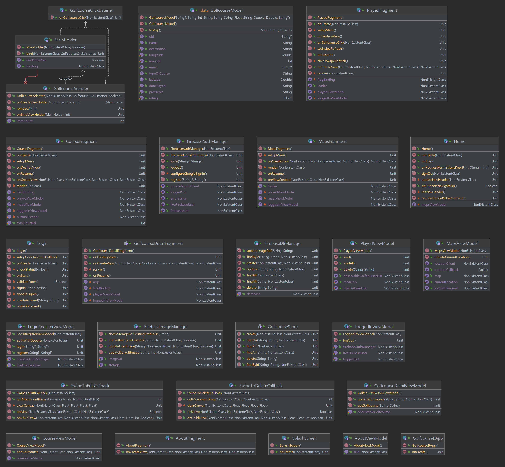

# README/TECHNICAL REPORT 

# Golfcourse Application - Assignment 2

## Name: David Cotter 
## Student Number: W20062924

### Brief description of App: 
This project is a Golfcourse Application where users are able to create
a list of courses that they have played. For each course they can specify the name, description of
the course, date they played the course, type of course, price of playing there, location of the course of the map.

On the main screen users can see the list of the courses created.
If they press the map tab it shows all the golf courses on a map with the title,amount and type of course.
This application is created entirely using Kotlin.

Firebase and is used for authentication, realtime database and storage.
Google API is used for the maps feature.

### UML & Class Diagrams

### UX / DX Approach Adopted

The UX is similar to the previous assignment, changing colors design palette that is easier on the eyes and to match the look of golfcourses
Used MVVM approach for the DX to ensure easier maintainability.

### Git approach
For the git approach i created two separate branches and committed to the development branch and then create pull request to merge.
I also tagged commits as several points during the creation.

### Personal Statement

This was a difficult assignment for me. I first tried to convert my assignment 1 into the MVVM but I kept getting issues.
Instead I decided to follow the labs using the donation casework as a guide and then switching it over to enable my features.
If I had more time I would've tried to input some custom UI Elements but I kept getting errors when trying it now and don't have time to pursue in detail.

### Any sources referred to during the development of the assignment :
https://chat.openai.com/ [ONLINE] [ACCESSED 15/12/23] 
https://www.w3schools.com/js/ [ONLINE] [ACCESSED 15/12/23]
https://www.geeksforgeeks.org/how-to-create-a-splash-screen-in-android-using-kotlin/ [ONLINE] [ACCESSED 21/12/23]
https://kotlinlang.org/docs/home.html [ONLINE] [ACCESSED 20/12/23]
https://firebase.google.com/docs/database [ONLINE] [ACCESSED 10/12/23]